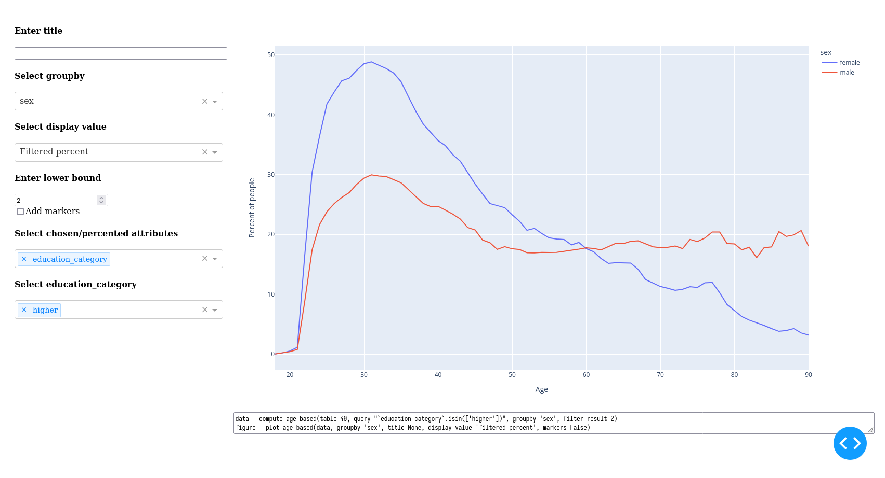
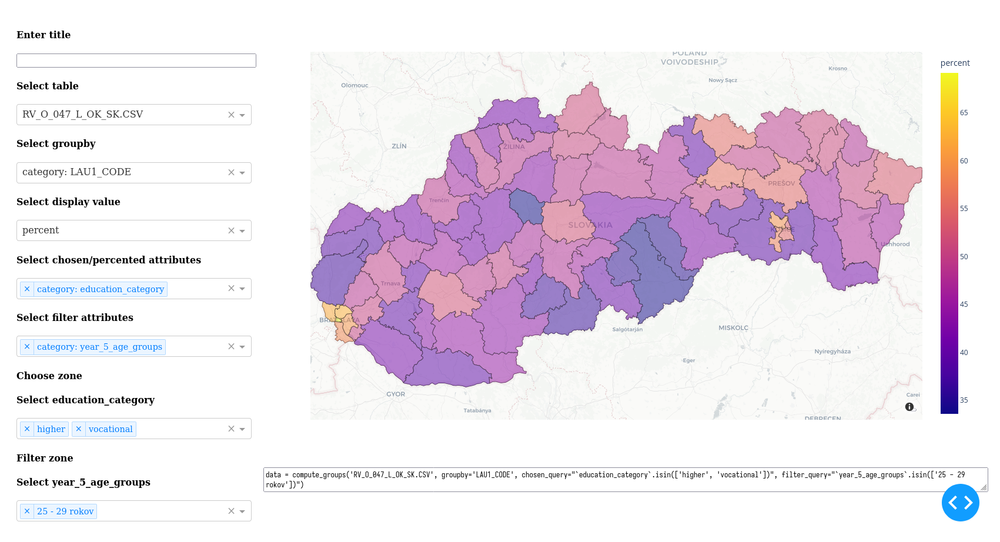

# Dash for Slovakia Education Analysis

This project was created to quickly check if a hypothesis is consistent with the data or to provide a deeper view on the data. The result of each notebook is a `dash` wep app. The data includes four types of tables. Only tables with district-level division were used. Works with `Google Colab`, importing the notebook is enough. The interactive part is on the left side, the plot and the code for it are on the right side.

## Tables description

Attributes of each table
1. `010` — sex, economic age groups, education level.
2. `040` — sex, age, economic activity, education level.
3. `047` — Employed population by sex, 5-year age groups, education and occupation (ISCO - classes).
4. `067` — Population according to current economic activity, sector of economic activity (NACE - section), occupation (ISCO - class) and education.

## Sources
- Data [source](https://www.scitanie.sk/obyvatelia/rozsirene-vysledky)
- Geo data [source](https://github.com/drakh/slovakia-gps-data/)

## Dash Age Notebook

Creates age-based plots. Uses only table `040`. Can be grouped by any categories of table `040`.

### Dash Age Example
Hypothesis - women were more constrained in education than man (women are marked by blue). This can be explored by displaying the percentage of people with higher education, grouped by sex.  

## Dash Geo Notebook

Creates other groupings, including geo plots. For geo plots, set the groupby selector to `*_CODE`. Works with different tables.

### Dash Geo Example

Displays the percentage of people with higher education in age group 25-29, grouped by districts. This gives a view on differences in demand for education in different districts.  
